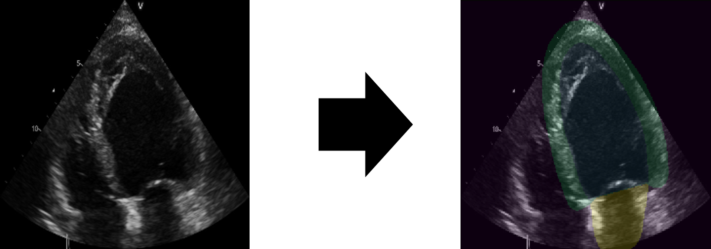

# Echo Segmentation

A repository for training segmentation algorithms for medical images. This repository is primarily developed for 
segmentation of apical four and two chamber echocardiography images like those from the 
[Camus](https://www.creatis.insa-lyon.fr/Challenge/camus/) and 
[EchoNet](https://echonet.github.io/dynamic/) datasets as well as other data with similar structure. 

## Install 

Clone this repo, create a new environment and install requirements using `pip install -r requirements.txt`

## Training

Use [train.py](train.py) to train a new model.

Run `python train.py -h` to see all available options (defined in [base_options](options/base_options.py) and 
[train_options](options/train_options.py)).

The main options that need to be defined are:
- **dataroot**: the path to the data. This should be a directory with subfolders for each phase. At least "train" and 
 "val" and optionally other phases (e.g. "test"). Within each phase folder should be a "images" folder and a "labels"
 folder. Each of these should contain pngs which have each training sample. The filenames in each directory should 
 match.
- **name**: The name of this training run.
- **experiment**: The experiment to group this run into.

See the provided help string for information on other options.

## Inference

Use [inference.py](inference.py) to evaluate a trained model. 

Run `python inference.py -h` to see available options. The main options match those above.

## Notes

Some parts of the code are specifically adapted for apical segmentation of the left ventricle
 (e.g. the [metrics](evaluators/__init__.py)) which assume 
specific regions are associated with specific classes. These will need to be updated for a new segmentation task. 

Some of the structure/code from this repository is based on 
[CycleGAN_and_pix2pix](https://github.com/junyanz/pytorch-CycleGAN-and-pix2pix).
